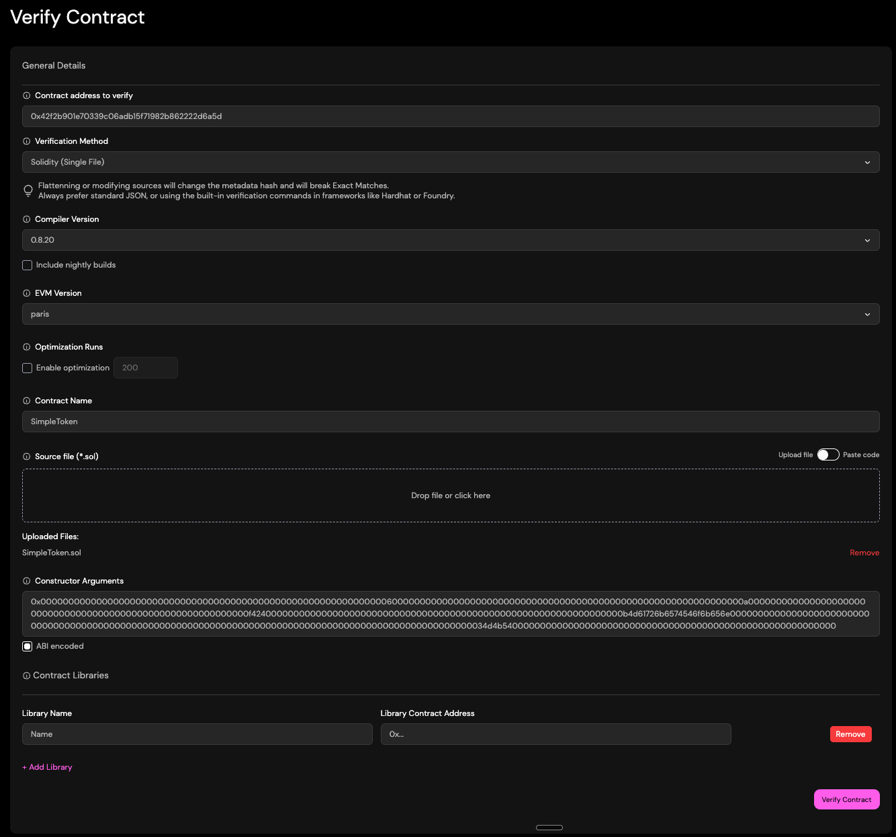
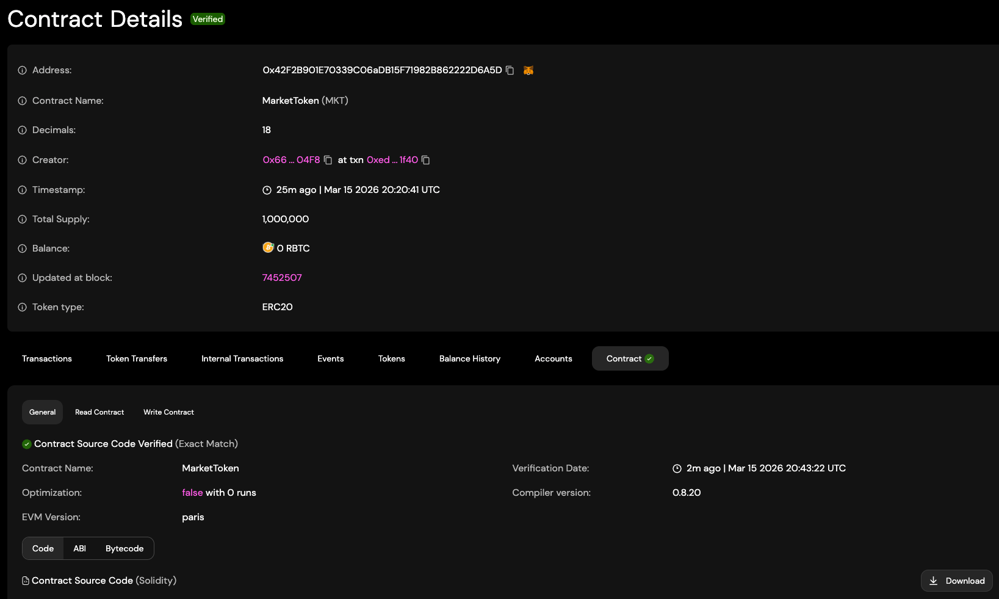

# Module 7 Assessment - Smart Contract Verification

Complete this file after deploying and verifying your contracts on RSK Testnet.

---

## (1) Verified Contract URLs

Provide the RSK Testnet Explorer URLs for each verified contract:

### SimpleToken

[`0x42F2B901E70339C06aDB15F71982B862222D6A5D`](https://explorer.testnet.rootstock.io/address/0x42F2B901E70339C06aDB15F71982B862222D6A5D?tab=contract)

### PriceOracle

[`0xCb705339896601418C4e892096eAC1490292aAe6`](https://explorer.testnet.rootstock.io/address/0xCb705339896601418C4e892096eAC1490292aAe6?tab=contract)

### NFTMarketplace

[`0x3E9ff12636c36e9A27e0B07f758426f5723b7976`](https://explorer.testnet.rootstock.io/address/0x3E9ff12636c36e9A27e0B07f758426f5723b7976?tab=contract)

---

## (2) Screenshot - Verification Form

Provide a screenshot of the RSK Testnet Explorer verification form for **one** of your contracts.
This should show the form filled out with the correct settings (compiler version, EVM version, etc.)



---

## (3) Screenshot - Verified Code Tab

Provide a screenshot of the RSK Testnet Explorer "Code" tab after successful verification for **one** of your contracts.
This should show the green checkmark and the verified source code.



---

## Notes (Optional)

Add any notes or observations from your verification process:

```text
Optimizer was disabled, took me the longest time to realize that!
```
